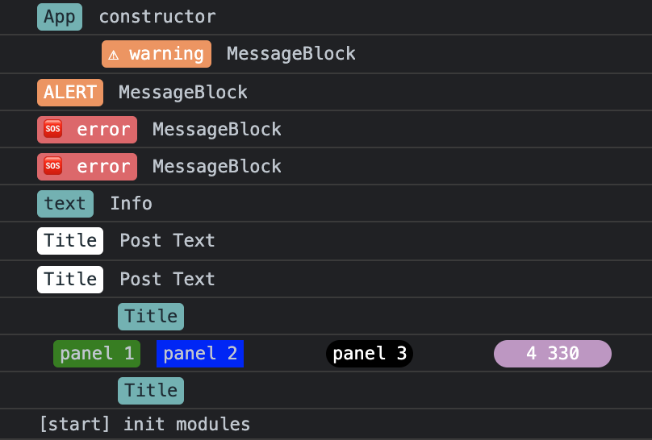
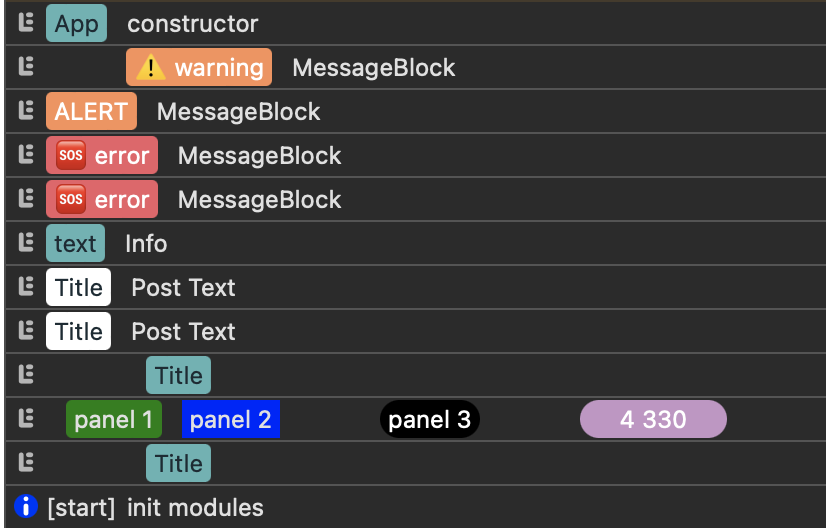

# Browser Logger

[](https://github.com/efureev/js-logger/actions/workflows/nodejs.yml)
[](https://codecov.io/gh/efureev/js-logger)
[](https://www.npmjs.com/package/@feugene/browser-logger)
[](https://conventionalcommits.org)

## Install

```shell
yarn add @feugene/browser-logger
```

## Example in Browsers

| Chrome | Safari |
|---|---|
|||

## Use

### Basic use

```js
import { BrowserLogger } from '@feugene/browser-logger'

const logger = new BrowserLogger()

// ...

logger.log('test')
logger.info('test', 'prefix', 3)
logger.error(new Message('test'))
```

### Advanced use

```js
import { Logger, ConsoleDriver, ColorCollection, LEVEL_INFO } from '@feugene/browser-logger'

const logger = new Logger(
  new Logger({
    driver: new ConsoleDriver(),
    colors: new ColorCollection({ // colors map
      black: '#000000',
      red: '#EC5f67',
      yellow: '#FAC863',
      green: '#99C794',
      blue: '#6699CC',
      white: '#FFFFFF',
    }),
    level: LEVEL_INFO
  })
)

// ...

this.logger.panel('Title', {
  bgColor: 'yellow', // => '#FAC863'
  color: 'teal', // => 'teal' because it absents in color map
  offset: 5,
})

// ...

const msg = new Message()
msg.pushBlock(MessageBlock.instance('prefix').color('#FFF').background('#00FFAA').paddingLeft(2))
msg.pushBlock(MessageBlock.instance('Basic text', { color: this.logger.getColors() }).color('red'))
logger.log(msg)
```

### Deep Advanced use

You can use your logger-wrapper with your custom panels:

```js
import { BrowserLogger, colors } from '@feugene/browser-logger'

export default class Logger {
  constructor(level) {
    this.logger = BrowserLogger(level)

    return new Proxy(this, {
      get(target, prop) {
        if (prop in target) {
          return target[prop]
        }
        return target.logger[prop]
      },
    })
  }

  warning(text, title = '⚠️ warning', offset = 0) {
    return this.logger.panel(
      title,
      { bgColor: colors.orange, color: colors.white, offset },
      text
    )
  }

  info(text, title = 'info', offset = 0) {
    return this.logger.panel(title, { bgColor: colors.teal, offset }, text)
  }

  error(text, title = '🆘 error', offset = 0) {
    return this.logger.panel(
      title,
      { bgColor: colors.red, color: colors.white, offset },
      text
    )
  }
}
```

And use it:

```js
import { Message, MessageBlock, colors } from '@feugene/browser-logger'

{
  // ...
  this.logger = new Logger()

  this.logger.warning('MessageBlock', undefined, 4)
  this.logger.warning('MessageBlock', 'ALERT')
  this.logger.error('MessageBlock')
  this.logger.error('MessageBlock')
  this.logger.info('Info', 'text')

  this.logger.panel('Title', undefined, 'Post Text')
  this.logger.panel('Title', {}, 'Post Text')
  this.logger.panel('Title', {
    bgColor: '#5FB3B3',
    color: '#1B2B34',
    offset: 5,
  })

  const colors = this.logger.getColors()
  const msg = Message.instance().pushBlock(
    MessageBlock.instance('panel 1', { colors: colors })
      .background('green')
      .borderRadius(3)
      .offsetLeft(1)
      .padding(2, 4),

    MessageBlock.instance('panel 2')
      .background(colors.get('blue'))
      .offsetLeft(1)
      .padding(2, 4),

    MessageBlock.instance('panel 3')
      .background('#000')
      .color('#fff')
      .borderRadius(10)
      .offsetLeft(5)
      .padding(2, 4),

    MessageBlock.instance('4 330')
      .background(colors.get('purple'))
      .color('#fff')
      .borderRadius(10)
      .offsetLeft(5)
      .padding(2, 20)
  )

  this.logger.log(msg)

  this.logger.panel('Title', {
    bgColor: '#5FB3B3',
    color: 'gray',
    offset: 5,
  })
}
```

## Features

### Log levels

The Logger logs messages by `Log Levels`.

There are 4 message types:

- Error
- Info
- Debug
- Trace

- There are 4 log levels:

- `LEVEL_ERROR` - Log only `Error` type messages
- `LEVEL_INFO` - Log only `Error` and `Info` type messages
- `LEVEL_DEBUG` - Log only `Error`, `Info` and `Debug` type messages
- `LEVEL_TRACE` - Log only `Error`, `Info`,`Debug` and `Trace` type messages
- `LOG_ALL` - It's an alias of `LEVEL_TRACE`

You may define log level of your Logger. By default, log level is `LOG_ALL`.  
You may point your own Log level:

```js
logger.setLevel(INFO | DEBUG) // will be logs only `info` & `debug` messages
```

### Methods

**Basic**

```js
const logger = new BrowserLogger(level)

logger.log()
logger.error()
logger.info()
logger.debug()
logger.trace()
```

**Panel**

```js
const logger = new BrowserLogger(level)

logger.panel(
  'App',
  { bgColor: 'red', color: 'white', offset: 2 },
  'description',
  'error'
)
```

**Panels**

```js
const logger = new BrowserLogger(level)

logger.panels(
  'info',
  { text: 'panel 1', bgColor: 'teal', color: 'yellow', borderRadius: 5 },
  { text: 'panel 2', color: 'white' },
  { text: 'panel 3', color: 'red', offset: 2, padding: 1 }
)

logger.panels(
  'trace',
  {
    text: 'App',
    bgColor: 'grayLight',
    color: 'gray',
    offsetLeft: 2,
    borderRadius: 3,
    padding: [2, 4],
  },
  'description'
)
```

### Debugging

```js
const defaultBlockConfig = {
  offsetLeft: 1,
  offsetRight: 1,
  borderRadius: 3,
  padding: [2, 4],
}

const panel = {
  ...defaultBlockConfig,
  bgColor: 'gray',
  color: 'white',
}

const makePanel = (text, panelConfig) => ({
  text,
  ...panel,
  ...panelConfig,
})
const prefixPanels = (prefix, ...panels) => logger.panels(
  prefix,
  makePanel('Application', { offsetLeft: 10 }),
  ...panels.map((panel) => {
    if (typeof panel === 'string') {
      return panel
    }

    return {
      padding: [2, 4],
      ...panel,
    }
  })
)

const names = ['first', 'second']
logger.enableDebug()
// or `logger.enableDebug({ printFragmented: true })`
// or `logger.enableDebug({ debugFn: console.log })`
// or `logger.enableDebug({ debugFn: logger.getDriver().output.log })`

prefixPanels(
  'trace',
  'Booter',
  4,
  'booted plugins',
  ...names.map((text) => this.logger.makeNamedPanel(text, 'tealLabel'))
)

logger.disableDebug()
```
